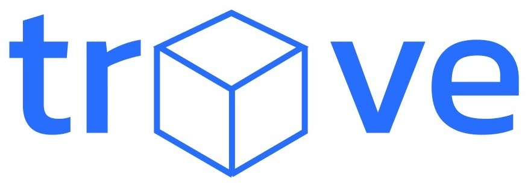
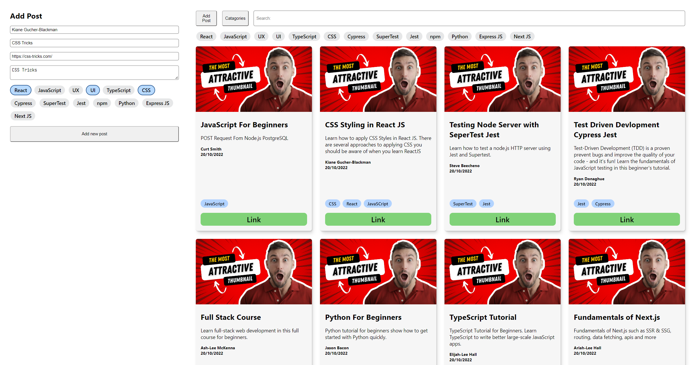

<h1 align="center">Welcome to Trove!</h1>

  

## The Problem

> How often do you share a link? Once a week? Once a day? Multiple types a day?
> How often do you receive a link and say to yourself: "I’ll visit that later..."? 
> A day goes by and you receive another link. A week goes by and you receive ten more. 
> Before you know it, you find yourself with a whole inventory of links to catch up on and they just keep stacking up!! 😭 

As bootcampers at School of Code, we are <mark>constantly</mark> receiving links on Slack, but without a well-organised place to store them, they soon disappear up the chat thread, never to be seen again.
What learners need is a dedicated and well-organised home for all these resources...

## Our Solution

Trove is searchable, filterable and persistent store for all these wonderful learning resources, built using `PostgreSQL`, `Express`, `React`, and `Node.js`

## Project Status
<mark>This project is currently in development</mark>. Users can browse resources and filter by title, as well as adding a new resource to the collection. 
Functionality to filter by post topic / tag / category is in progress - watch this space! 👀

## Project Screen Shot(s)

  

## Installation and Setup Instructions

Clone down this repository. You will need `node` and `npm` installed globally on your machine.  

Installation:

`npm install`  

To Run Test Suite:  

`npm test`  

To Start Server:

`npm start`  

To Visit App:

`localhost:3000`  

## Project Goals

This was a 1-week project built during my nineth week at the School of Code bootcamp. Project goals included:  

✅ Tackling a real-world problem for fellow bootcampers  
✅ Using technologies learned up until this point  
✅ Familiarising myself with documentation using JSDoc  

## Reflections

### Overview

After initial user research, our team decided we would build an application that allowed fellow bootcampers to browse, search, filter and contribute to vast collection of learning resources. 

We built the frontend and backend as two seperate applications, linking them together around half-way through the week. 

### Challenges Faced

One of the main challenges we ran into was the use of category 'tags' and complications that arose from the re-use of custom react components. This lead to us having to spend a large chunk of our time trying to get the feature working, as we felt it was an integral part of our agreed MVP, however, this turned out to be time well-spent, and we learned a lot along the way.

Due to project time constraints, we had to be pragmatic and cohesive within the team in order to pull off an entire app in less than 1 week. 

### Conclusion

We used the PERN technology stack (`PostgreSQL`, `Express`, `React`, and `Node.js`) to build a full-stack web application with CRUD operations, employing the `create-react-app` boilerplate to minimize initial setup and invest more time elsewhere. 

### The Future of Trove

We plan to continue adding features to the app, focussing next on simple user authentication/login, which will enable us to safely deploy the app, restricting access to just learners on the bootcamp.
